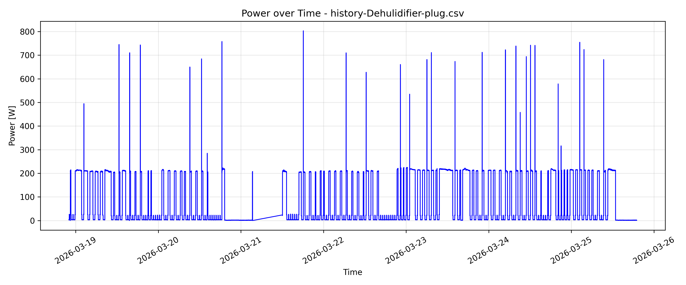
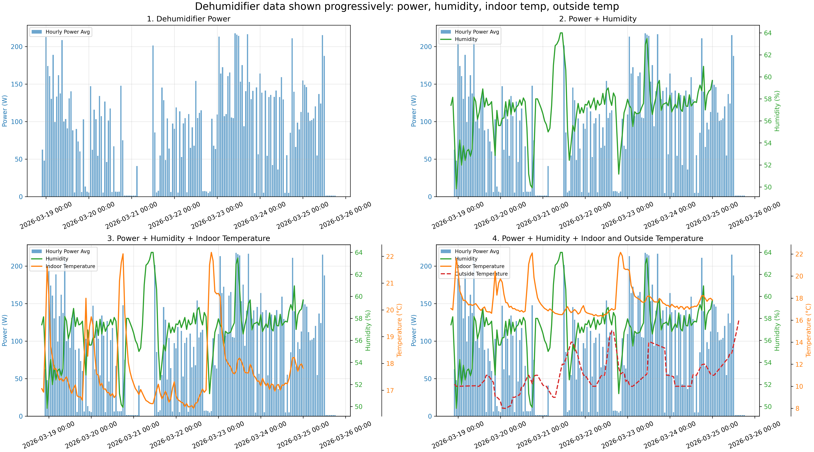
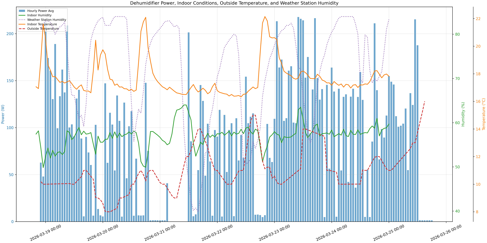
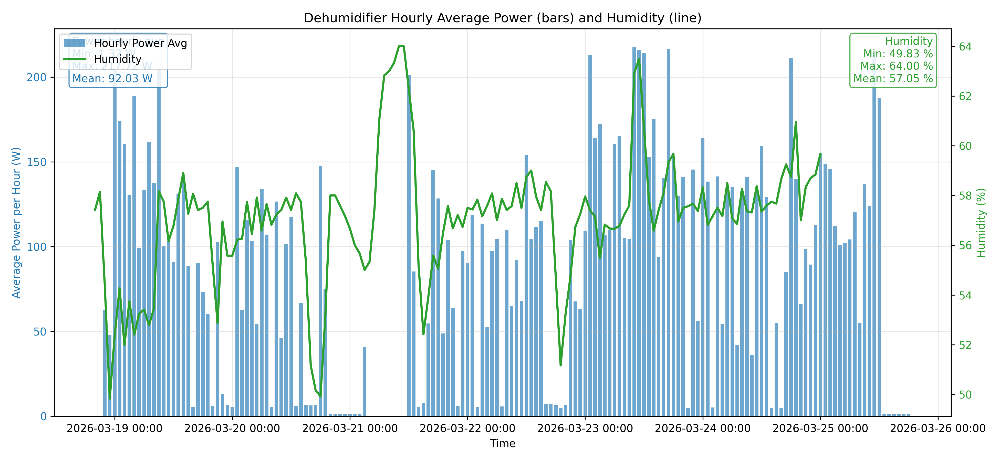
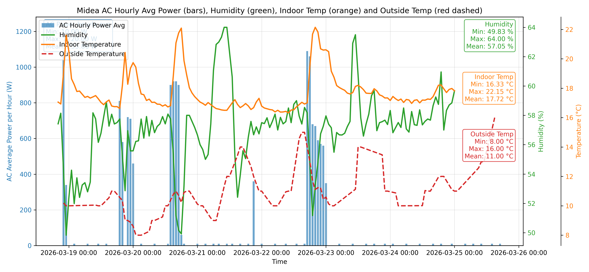

# Τελικό Verdict Έργου  
## Ανάλυση Κατανάλωσης Ενέργειας σε Οικιακές Συσκευές (Home Assistant)

  

---

## 📌 Εκτελεστική Σύνοψη

Η ανάλυση των δεδομένων δείχνει ότι:

- το **κλιματιστικό (AC)** αποτελεί τον κύριο παράγοντα κατανάλωσης ενέργειας,
- ο **αφυγραντήρας** λειτουργεί πιο ήπια και διακεκομμένα,
- η κατανάλωση και των δύο συσκευών επηρεάζεται άμεσα από τις **περιβαλλοντικές συνθήκες** (θερμοκρασία/υγρασία),
- για αξιόπιστα συμπεράσματα πρέπει να εξαιρούνται **άκυρες/παροδικές αιχμές** (startup peaks και ειδικές μη αντιπροσωπευτικές περίοδοι).

---

## 🎯 Στόχος της Μελέτης

Η μελέτη στοχεύει στη μετατροπή ακατέργαστων μετρήσεων κατανάλωσης σε πρακτικές αποφάσεις για:

1. μείωση κόστους ενέργειας,
2. βελτιστοποίηση λειτουργίας συσκευών,
3. καλύτερη στρατηγική αυτοματισμών στο σπίτι.

---

## 📊 Κύρια Αποτελέσματα

### 1) Αφυγραντήρας

- **Μέγιστη στιγμιαία τιμή:** ~803.10 W  
- **Ελάχιστη:** 0.00 W  
- **Μέση τιμή (7 ημέρες):** ~101.37 W  
- Σε ωριακή/προοδευτική απεικόνιση, η ισχύς κινείται περίπου έως **~220 W** με μέση τιμή ~**92.03 W**.
- Η λειτουργία του ακολουθεί τα επίπεδα υγρασίας (όταν η υγρασία ανεβαίνει, ενεργοποιείται συχνότερα).

### 2) Κλιματιστικό (Midea AC – Inverter)

- **Μέγιστη στιγμιαία τιμή:** ~4754.67 W (αιχμές εκκίνησης)  
- **Ελάχιστη:** 0.00 W  
- **Μέση τιμή (7 ημέρες):** ~986.23 W  
- Σε προοδευτική/ωριακή ανάλυση η μέση ισχύς είναι ~**366.71 W**, με μέγιστα περίπου **~1430 W**.
- Σε παράθυρο 8 ωρών, καταγράφονται έντονες μεταβολές inverter με μέση τιμή ~**943.14 W**.

### 3) Περιβαλλοντική Συσχέτιση

- Η **υγρασία** σχετίζεται έντονα με τη λειτουργία του αφυγραντήρα.
- Η **θερμοκρασία** σχετίζεται με κύκλους λειτουργίας του AC (θερμοστατική συμπεριφορά).

---

## 🔍 Εμβάθυνση: Συμπεριφορά Inverter AC vs Non-Inverter Αφυγραντήρα

Τα δύο μηχανήματα παρουσιάζουν **θεμελιωδώς διαφορετικό προφίλ κατανάλωσης**, παρότι και τα δύο είναι «θερμοδυναμικές» συσκευές με συμπιεστή. Η διαφορά οφείλεται στον τρόπο ελέγχου του συμπιεστή.

### 🌀 Inverter AC (Midea, living room)

- Ο συμπιεστής **δεν λειτουργεί με on/off**: χρησιμοποιεί μετατροπέα συχνότητας που ρυθμίζει συνεχώς τις στροφές.
- Στην εκκίνηση εμφανίζεται **έντονη αιχμή ισχύος (~4.7 kW)** για λίγα δευτερόλεπτα, καθώς ο inverter «τραβάει» ρεύμα για να ανέβει γρήγορα ο συμπιεστής στο επιθυμητό φορτίο. Αυτή είναι **παροδική (startup peak)** και δεν αντιπροσωπεύει κανονική λειτουργία.
- Μετά την αιχμή, η ισχύς **μειώνεται προοδευτικά** καθώς το δωμάτιο πλησιάζει το setpoint: το profile είναι «καμπάνα» ή σκαλωτή πτώση, όχι τετραγωνικός παλμός.
- Σε σταθερή κατάσταση (steady-state) ο inverter «κουρδίζει» την ισχύ σε μια **συνεχή, μεταβλητή ζώνη ~200–1500 W** ανάλογα με τη διαφορά εσωτερικής/εξωτερικής θερμοκρασίας. Όσο μεγαλύτερη η διαφορά (πιο ζεστή μέρα), τόσο υψηλότερη η ζώνη.
- Γι' αυτό η **μέση ωριαία ισχύς (~367 W)** είναι πολύ μικρότερη από τη μέγιστη: ο inverter περνά τον περισσότερο χρόνο σε χαμηλές–μέτριες στροφές και σπάνια στο 100%.
- **Σημαντικό**: η ίδια η ψυκτική απόδοση (BTU που παράγει) **δεν είναι ανάλογη** της στιγμιαίας ισχύος όπως σε on/off. Ένα inverter στα 400 W μπορεί να αποδίδει αναλογικά **καλύτερο COP** από το ίδιο στα 1400 W.
- **Πρακτική συνέπεια**: λιγότερες, μακρύτερες εκκινήσεις = λιγότερες startup peaks = χαμηλότερη συνολική κατανάλωση. Συχνά setpoint changes ή «on/off από remote» χαλάνε αυτό το πλεονέκτημα.

### 💧 Non-Inverter Αφυγραντήρας

- Ο συμπιεστής είναι **σταθερής ταχύτητας**: ή λειτουργεί στο ονομαστικό φορτίο, ή είναι σβηστός.
- Στα γραφήματα φαίνεται καθαρά σαν **«τετραγωνικός παλμός» (square wave)**: όταν ενεργοποιείται, η ισχύς πηδά γρήγορα στα **~200–220 W** (ωριακός μέσος, με στιγμιαία ~800 W κατά το startup) και μένει εκεί μέχρι ο υγροστάτης να φτάσει το όριο, οπότε σβήνει στα **0 W**.
- Δεν υπάρχει «ενδιάμεση» κατάσταση: το ιστόγραμμα των τιμών είναι **διπολικό** (κοντά στο 0 ή κοντά στο ονομαστικό), ενώ του AC είναι **απλωμένο** σε όλο το φάσμα.
- Οι κύκλοι **ON** είναι σχετικά σύντομοι και πυκνώνουν όταν η υγρασία περιβάλλοντος ανεβαίνει (π.χ. με βροχή ή μετά από μπάνιο). Όταν η υγρασία είναι χαμηλή, ο αφυγραντήρας μένει εκτός για ώρες.
- Η **μέση ωριαία ισχύς (~92 W)** δεν αντικατοπτρίζει τη λειτουργία του συμπιεστή – είναι ο μέσος όρος **ενεργών + ανενεργών** ωρών. Όταν δουλεύει, δουλεύει στα ~220 W.
- Σε αντίθεση με τον inverter, η αιχμή εκκίνησης (~800 W) **δεν είναι αντιπροσωπευτική** της κατανάλωσης – είναι **inrush current** του μοτέρ για κλάσματα του δευτερολέπτου και πρέπει να φιλτράρεται από στατιστικά «μέγιστης ισχύος».

### ⚖️ Συγκριτικός Πίνακας

| Χαρακτηριστικό | Inverter AC | Non-Inverter Αφυγραντήρας |
|---|---|---|
| Έλεγχος συμπιεστή | Συνεχής, μεταβλητής συχνότητας | Διακοπτικός (on/off) |
| Σχήμα γραφήματος ισχύος | Καμπάνα / κυματισμός | Τετραγωνικός παλμός |
| Startup peak | ~4750 W (πραγματικός – inverter επιταχύνει) | ~800 W (στιγμιαίο inrush του μοτέρ) |
| Ονομαστική λειτουργία | 200–1500 W (μεταβλητή) | ~220 W (σταθερή) |
| Λόγος Max/Mean ωριαίος | ~3.9× (1430/367) | ~2.4× (220/92) |
| Οδηγείται από | Θερμοκρασία (Δθ in–out) | Υγρασία (υγροστάτης) |
| Βέλτιστη στρατηγική | Λίγες, μεγάλες περίοδοι λειτουργίας | Σωστά thresholds υγρασίας |

### 🧪 Συμπέρασμα της σύγκρισης

Το AC είναι **μεγαλύτερος και «ευφυέστερος» καταναλωτής** – προσαρμόζει συνεχώς την ισχύ του στις συνθήκες, γι' αυτό η αξιολόγησή του πρέπει να γίνεται σε **ωριαίους/ημερήσιους μέσους όρους** και όχι από τη στιγμιαία αιχμή. Ο αφυγραντήρας είναι **απλούστερος και προβλέψιμος**: η συνολική του κατανάλωση εξαρτάται σχεδόν αποκλειστικά από το **duty cycle** (πόσες ώρες την ημέρα είναι ON), όχι από την ένταση λειτουργίας.

---

## 🧭 Πλήρες Verdict 

Το προφίλ κατανάλωσης του νοικοκυριού χαρακτηρίζεται από **κυκλική και συνθηκο-εξαρτώμενη λειτουργία**.  
Ο αφυγραντήρας εμφανίζει **χαμηλότερη και πιο ελεγχόμενη ενεργειακή επιβάρυνση**, ενώ το κλιματιστικό παρουσιάζει **σαφώς υψηλότερη ενεργειακή ένταση** με έντονες στιγμιαίες αιχμές κατά την εκκίνηση και ρύθμιση φορτίου.

Η πιο ουσιαστική ευκαιρία βελτιστοποίησης εντοπίζεται στο AC: η μείωση των συχνών κύκλων εκκίνησης/διακοπής και η λειτουργία με κατάλληλα όρια θερμοκρασίας οδηγούν στη μεγαλύτερη δυνατή εξοικονόμηση.  
Παράλληλα, η λειτουργία του αφυγραντήρα πρέπει να καθοδηγείται από όρια υγρασίας ώστε να αποφεύγεται άσκοπη κατανάλωση.

Επομένως, το έργο τεκμηριώνει ότι η **βέλτιστη στρατηγική** είναι:

1. **προτεραιότητα βελτιστοποίησης στο AC** (μεγαλύτερος ενεργειακός αντίκτυπος),  
2. **αυτοματισμοί με περιβαλλοντικά thresholds** (θερμοκρασία/υγρασία),  
3. **αποκλεισμός άκυρων ή παροδικών αιχμών** από την κανονικοποιημένη αξιολόγηση απόδοσης.

---

## ✅ Προτεινόμενο “Most Optimal Verdict” 

> Το κλιματιστικό είναι ο βασικός καταναλωτής ενέργειας του συστήματος, ενώ η λειτουργία και των δύο συσκευών καθορίζεται από θερμοκρασία και υγρασία.  
> Άρα, η πιο αποδοτική στρατηγική είναι αυτοματισμοί με όρια περιβάλλοντος και περιορισμός των συχνών εκκινήσεων του AC, με ταυτόχρονη χρήση φιλτραρισμένων δεδομένων χωρίς μη αντιπροσωπευτικές αιχμές.

---

## 🖼️ Γραφήματα Τεκμηρίωσης

### Αφυγραντήρας — Εβδομαδιαία κατανάλωση

  

**Τι δείχνει:** Η στιγμιαία ισχύς (W) του αφυγραντήρα για μία ολόκληρη εβδομάδα.
**Πώς διαβάζεται:** Είναι ευδιάκριτα τα **τετράγωνα πλατό** γύρω στα 200 W (ο συμπιεστής σε λειτουργία) και τα μηδενικά διαστήματα (ο συμπιεστής σβηστός). Οι μεμονωμένες κορυφές ~800 W είναι **startup spikes** του μοτέρ – δεν αντιπροσωπεύουν κανονικό φορτίο. Επιβεβαιώνει τη συμπεριφορά **on/off** του non-inverter.

### Αφυγραντήρας — Προοδευτική ανάλυση (ισχύς, υγρασία, θερμοκρασίες)

  

**Τι δείχνει:** 4 πάνελ που χτίζονται **προοδευτικά**: (1) μόνο ωριαία ισχύς, (2) ισχύς + εσωτερική υγρασία, (3) + εσωτερική θερμοκρασία, (4) + εξωτερική θερμοκρασία.
**Πώς διαβάζεται:** Στο 2ο πάνελ φαίνεται καθαρά η **αντίστροφη σχέση** ισχύος–υγρασίας: κάθε φορά που η πράσινη γραμμή (υγρασία) ανεβαίνει, οι μπλε μπάρες (ισχύς) ενεργοποιούνται μέχρι να την «ρίξουν». Στο 4ο πάνελ βλέπουμε ότι όταν η εξωτερική θερμοκρασία πέφτει (περισσότερη συμπύκνωση), αυξάνεται και η εσωτερική υγρασία – άρα αυξάνεται και η ζήτηση για αφύγρανση. Είναι το γράφημα-«αφήγηση» που εξηγεί **γιατί** ενεργοποιείται η συσκευή.

### Αφυγραντήρας + Εξωτερική υγρασία

  

**Τι δείχνει:** Στοιβαγμένα γραφήματα ισχύος αφυγραντήρα σε σχέση με: εσωτερική υγρασία, **υγρασία μετεωρολογικού σταθμού**, εσωτερική και εξωτερική θερμοκρασία.
**Πώς διαβάζεται:** Η εξωτερική (μωβ) και η εσωτερική (πράσινη) υγρασία κινούνται **συσχετισμένα αλλά όχι ταυτόσημα** – ο τοίχος και ο εξαερισμός εισάγουν καθυστέρηση. Ο αφυγραντήρας ακολουθεί την **εσωτερική** υγρασία, όχι την εξωτερική. Επιβεβαιώνει ότι αυτοματισμοί μόνο με weather API θα ήταν λάθος – χρειάζεται **εσωτερικός αισθητήρας**.

### Αφυγραντήρας — Μέση ωριαία ισχύς και υγρασία

  

**Τι δείχνει:** Η ίδια σχέση ισχύος–υγρασίας, αλλά **ομαλοποιημένη** σε ωριαίο μέσο όρο.
**Πώς διαβάζεται:** Εξαφανίζονται οι startup spikes και μένει το **πραγματικό φορτίο** (~90 W μέσος, ~220 W μέγιστος ωριαίος). Καθαρή εικόνα του duty cycle: όσο πιο υψηλή η πράσινη γραμμή (υγρασία), τόσο πιο πυκνές και ψηλές οι μπλε μπάρες.

### Κλιματιστικό — Εβδομαδιαία κατανάλωση

  

**Τι δείχνει:** Η στιγμιαία ισχύς του AC για 7 ημέρες.
**Πώς διαβάζεται:** Σε αντίθεση με τον αφυγραντήρα, **δεν υπάρχουν τετράγωνα πλατό**. Φαίνονται **καμπυλωτές περιοχές** (modulation του inverter) και απομονωμένες κάθετες αιχμές ~4.5–4.7 kW στις στιγμές εκκίνησης. Ολόκληρα διαστήματα έντονης λειτουργίας συμπίπτουν με τις πιο ζεστές ώρες της ημέρας.

### Κλιματιστικό — Μεγέθυνση 8 ωρών

  

**Τι δείχνει:** Zoom σε 8ωρο διάστημα ώστε να φανούν λεπτομέρειες του inverter.
**Πώς διαβάζεται:** Καθαρά εμφανές το **inverter modulation**: η ισχύς ανεβαίνει στα ~1.4 kW, σταδιακά πέφτει στα ~400–600 W (όταν πλησιάζει το setpoint), και ξαναπροσαρμόζεται. **Δεν υπάρχει on/off** όπως στον αφυγραντήρα – υπάρχει συνεχής, μεταβλητή ισχύς. Αυτό είναι το «οπτικό αποτύπωμα» ενός σύγχρονου inverter.

### 🆕 Κλιματιστικό — Ισχύς, υγρασία και θερμοκρασίες (αναλυτικό)

  

**Τι δείχνει:** Το **αντίστοιχο γράφημα του AC** με αυτό του αφυγραντήρα – ωριαία μέση ισχύς (μπάρες) μαζί με εσωτερική υγρασία (πράσινη), εσωτερική θερμοκρασία (πορτοκαλί) και εξωτερική θερμοκρασία (κόκκινη διακεκομμένη). Περιλαμβάνει min/max/mean στατιστικά σε κουτιά για κάθε μεταβλητή.
**Πώς διαβάζεται:** 
- Οι μπλε μπάρες **«κορυφώνουν» όταν η κόκκινη γραμμή (εξωτερική θερμοκρασία) ανεβαίνει** – η ζήτηση του AC οδηγείται κυρίως από τη διαφορά εσωτερικής-εξωτερικής θερμοκρασίας.
- Η εσωτερική θερμοκρασία (πορτοκαλί) παραμένει σχετικά **σταθερή σε ένα στενό εύρος** – αυτό είναι το «έργο» του AC: κρατάει το δωμάτιο στο setpoint παρά τη μεταβολή της εξωτερικής.
- Η εσωτερική υγρασία **πέφτει όταν δουλεύει το AC**, γιατί το AC αφυγραίνει σαν δευτερεύουσα δράση (συμπύκνωση στο εσωτερικό στοιχείο). Αυτό εξηγεί γιατί το καλοκαίρι ο αφυγραντήρας δουλεύει λιγότερο – ο AC κάνει μέρος της δουλειάς του.
- Σε αντίθεση με τον αφυγραντήρα, **δεν υπάρχει on/off pattern** στις μπάρες – υπάρχει συνεχής μεταβλητή έντασης λειτουργία.

---

## 🔚 Τελικό Συμπέρασμα

Η ανάλυση αποδεικνύει ότι η ενεργειακή βελτιστοποίηση πρέπει να ξεκινήσει από το AC, επειδή εκεί βρίσκεται η μεγαλύτερη κατανάλωση και μεταβλητότητα.  
Με σωστούς αυτοματισμούς, όρια θερμοκρασίας/υγρασίας και καθαρή αξιολόγηση δεδομένων (χωρίς άκυρες αιχμές), το σπίτι μπορεί να πετύχει **μικρότερο κόστος**, **σταθερότερη λειτουργία** και **καλύτερο ενεργειακό αποτύπωμα**.
