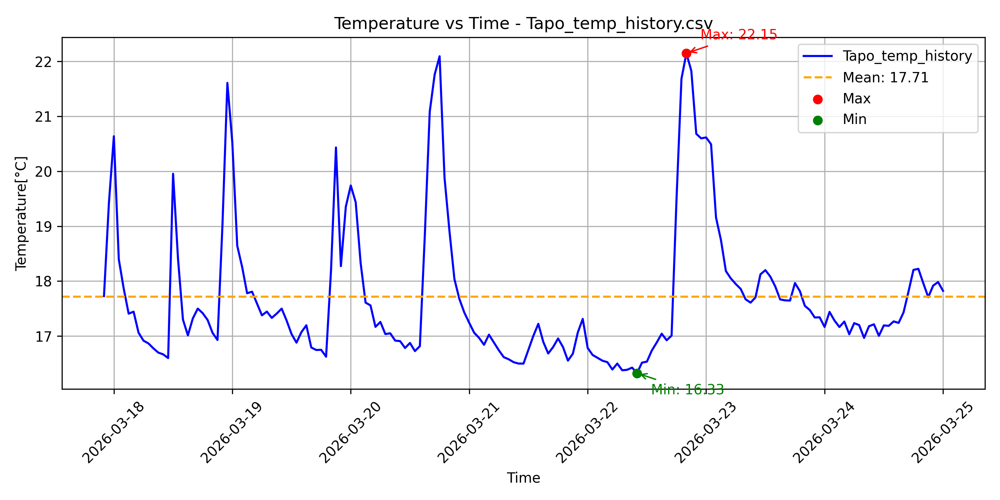
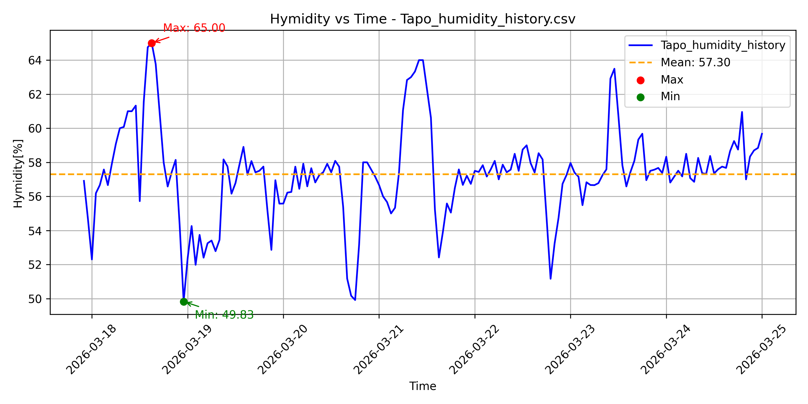

# Κατανάλωση Ηλεκτρικής Ενέργειας

## 1. Περιγραφή
Το σύνολο δεδομένων περιλαμβάνει μετρήσεις κατανάλωσης ενέργειας από δύο οικιακές συσκευές:

- Αφυγραντήρας (Dehumidifier)
- Κλιματιστικό (Midea Living Room AC)

Τα δεδομένα χρησιμοποιούνται για την ανάλυση της ενεργειακής συμπεριφοράς των συσκευών στον χρόνο.

## 2. Πηγές δεδομένων και συλλογή
Τα δεδομένα συλλέχθηκαν μέσω smart home συστήματος (π.χ. Home Assistant) και συγκεκριμένα από αισθητήρες κατανάλωσης ενέργειας (smart plugs / energy sensors).

Κάθε εγγραφή περιλαμβάνει:

- το αναγνωριστικό του αισθητήρα (`entity_id`)
- την τιμή μέτρησης (`state`)
- τη χρονική στιγμή καταγραφής (`last_changed`)

Τα δεδομένα αποθηκεύτηκαν σε μορφή CSV και η προεπεξεργασία και η ανάλυση πραγματοποιήθηκαν με scripts σε Python.

## 3. Δομή των δεδομένων

### Αφυγραντήρας

| Στήλη   | Τύπος     | Περιγραφή |
|--------------|----------|-------------|
| entity_id     | string   | ID αισθητήρα |
| state         | float    | κατανάλωση (W) |
| last_changed  | datetime | χρονική στιγμή μέτρησης |

### Δείγμα δεδομένων

| entity_id | state | last_changed |
|----------|------|-------------|
| sensor.dehumidifier_plug_current_consumption | 20.6 | 2026-03-22T22:19:37.698Z |
| sensor.dehumidifier_plug_current_consumption | 20.7 | 2026-03-22T22:19:57.707Z |
| sensor.dehumidifier_plug_current_consumption | 20.6 | 2026-03-22T22:20:02.702Z |
| sensor.dehumidifier_plug_current_consumption | 660.4 | 2026-03-22T22:20:12.699Z |
| sensor.dehumidifier_plug_current_consumption | 197.5 | 2026-03-22T22:20:17.697Z |
| sensor.dehumidifier_plug_current_consumption | 210.1 | 2026-03-22T22:20:22.704Z |
| sensor.dehumidifier_plug_current_consumption | 213.2 | 2026-03-22T22:20:27.700Z |
| sensor.dehumidifier_plug_current_consumption | 214.7 |2026-03-22T22:20:37.701Z |
| sensor.dehumidifier_plug_current_consumption | 215.5 | 2026-03-22T22:20:42.700Z |
| sensor.dehumidifier_plug_current_consumption | 216.9 | 2026-03-22T22:20:47.698Z |
| sensor.dehumidifier_plug_current_consumption | 217.3 | 2026-03-22T22:20:52.703Z |
| sensor.dehumidifier_plug_current_consumption | 217.2 | 2026-03-22T22:21:02.706Z |
| sensor.dehumidifier_plug_current_consumption | 217.4 | 2026-03-22T22:21:07.700Z |

---

### AC

| Στήλη   | Τύπος     | Περιγραφή |
|--------------|----------|-------------|
| entity_id     | string   | ID αισθητήρα |
| state         | float    | συνολική κατανάλωση ενέργειας (kWh) |
| last_changed  | datetime | χρονική στιγμή μέτρησης |

### Δείγμα δεδομένων

| entity_id | state | last_changed |
|----------|------|-------------|
| sensor.153931628473058_total_energy_consumption | 1360.47 | 2026-03-22T22:00:00.000Z |
| sensor.153931628473058_total_energy_consumption | 1360.48 | 2026-03-22T22:03:52.306Z |
| sensor.153931628473058_total_energy_consumption | 1360.49 | 2026-03-22T22:04:25.511Z |
| sensor.153931628473058_total_energy_consumption | 1360.5 | 2026-03-22T22:04:58.690Z |
| sensor.153931628473058_total_energy_consumption | 1360.51 | 2026-03-22T22:05:32.093Z |
| sensor.153931628473058_total_energy_consumption | 1360.52 | 2026-03-22T22:06:05.323Z |
| sensor.153931628473058_total_energy_consumption | 1360.53 | 2026-03-22T22:07:12.299Z |
| sensor.153931628473058_total_energy_consumption | 1360.54 | 2026-03-22T22:07:46.626Z |
| sensor.153931628473058_total_energy_consumption | 1360.55 | 2026-03-22T22:08:19.807Z | 
| sensor.153931628473058_total_energy_consumption | 1360.56 | 2026-03-22T22:09:26.319Z |
| sensor.153931628473058_total_energy_consumption | 1360.57 | 2026-03-22T22:09:59.523Z |
| sensor.153931628473058_total_energy_consumption | 1360.58 | 2026-03-22T22:14:25.731Z |
| sensor.153931628473058_total_energy_consumption | 1360.59 | 2026-03-22T22:14:58.978Z |

## 4. Οπτικοποίηση

### A. Αφυγραντήρας

Καταγραφή για μία εβδομάδα. Η κατανάλωση βρίσκεται τις περισσότερες φορές είτε σε πολύ χαμηλά επίπεδα, που αντιστοιχούν σε κατάσταση αναμονής, είτε σε σταθερά μεσαία επίπεδα, που αντιστοιχούν σε κανονική λειτουργία. Παρατηρούνται επίσης στιγμιαίες κορυφώσεις κατανάλωσης που συμβαίνουν κατά την εκκίνηση της συσκευής.

- Η μέγιστη τιμή της κατανάλωσης, δηλαδή η υψηλότερη καταγραμμένη τιμή του state κατά την 7-ήμερη περίοδο, ανέρχεται σε 803.10 W και αποτυπώνεται με την κόκκινη τελεία.

- H ελάχιστη τιμή της κατανάλωσης δηλαδή η χαμηλότερη καταγραμμένη τιμή του state κατά την 7-ήμερη περίοδο, είναι 0.00 W και απωτυπώνεται με την πράσινη τελεία.

- Η μέση τιμή της κατανάλωσης στο διάστημα των 7-ημερών ανέρχεται σε 101.37 W και αποτυπώνεται με την κίτρινη διακκεκομένη γραμμή.

#### Άκυρες Τιμές 
Στον αφρυγαντήρα, πρέπει να αποκλειστούν οι μετρήσεις από την 21-03-2026 έως 22-03-2026, καθόσον το δοχείο νερού ήταν πλήρες, με αποτέλεσμα την ελαχιστοποίηση της λειτουργίας του. Αυτή η περίοδος δεν αντικατοπτρίζει την κανονική κατανάλωση και θα πρέπει να επισημανθεί ως μη έγκυρη στην ανάλυση.

### B. Κλιματιστικό (Midea Living Room AC)

Καταγραφή για μία εβδομάδα. Υπάρχουν μεγάλα διαστήματα μηδενικής κατανάλωσης (το κλιματιστικό εκτός λειτουργίας) και στιγμές όπου η ισχύς κινείται σε μεσαία έως υψηλά επίπεδα. Σε ορισμένες εκκινήσεις εμφανίζονται και έντονες αιχμές κατανάλωσης.

- Η μέγιστη τιμή της κατανάλωσης δηλαδή η υψηλότερη καταγραμμένη τιμή του state κατά την 7-ήμερη περίοδο, ανέρχεται σε 4754.67 W και αποτυπώνεται με την κόκκινη τελεία. Αυτό είναι το peak αφού όπως αναλύθηκε με την εκκίνηση της συσκευής η συσκευή χρησιμοποιηεί μια κατά πολύ μεγαλύτερη ενέργεια για να γίνει σωστά η λειτουργία του. 

- H ελάχιστη τιμή της κατανάλωσης δηλαδή η χαμηλότερη καταγραμμένη τιμή του state κατά την 7-ήμερη περίοδο, είναι 0.00 W και απωτυπώνεται με την κίτρινη τελεία. Σε αυτό το σημείο η συσκευή είναι κλειστή. Τα επόμενα ελάχιστα σημεία στο γράφημα είναι περίπου 20W όπου τότε ανοίγει ο ανεμιστήρας και δεν είναι ανοιχτή η αντλεία θερμότητας.

- Η μέση τιμή της κατανάλωσης στο διάστημα των 7-ημερών ανέρχεται σε 986.23 W και αποτυπώνεται με την πράσινη διακκεκομένη γραμμή.

#### Άκυρες Τιμές 
Η στιγμιαία υψηλή κορύφωση στο διάγραμμα μας 4500W-4700W είναι άκυρες τιμές. Όταν ο κλιματιστής ενεργοποιείται, ο συμπιεστής και ο ανεμιστήρας απαιτούν υψηλή ισχύ για να ξεκινήσουν, φτάνοντας συχνά τα 4000-6000 W. Αυτή η απότομη αιχμή διαρκεί δευτερόλεπτα και μετά πέφτει στην κανονική λειτουργία (π.χ. 1500W-2500W).

### Μεγέθυνση σε 1-ημέρα(Για 8 ώρες)
Καταγραφή για 8 ώρες (17:00 εώς 01:00). Στην αρχή φαίνεται σταθερή κατάσταση με σχετικά υψηλή κατανάλωση, με μερικές πολύ ψηλές αιχμές (τυπικά συμβαίνουν σε εκκίνηση/απότομη αύξηση φορτίου). Στις 19:00 η ισχύς κυμαίνεται με συχνές μεταβολές, που μοιάζει με ρύθμιση inverter (ο συμπιεστής ανεβοκατεβάζει στροφές για να κρατήσει θερμοκρασία). Οι επαναλαμβανόμενες καταστάσεις δείχνουν φάσεις χαμηλής ισχύος/ρύθμισης.

- Η μέγιστη τιμή της κατανάλωσης δηλαδή η υψηλότερη καταγραμμένη τιμή του state κατά των παραδειγματικών ωρών ανέρχεται σε 2697.24 W και αποτυπώνεται με την κόκκινη τελεία. Eκείνη την στιγμή είναι το peak κατά την εκκίνηση. 

- H ελάχιστη τιμή της κατανάλωσης δηλαδή η χαμηλότερη καταγραμμένη τιμή του state κατά των παραδειγματικών ωρών ανέρχεται σε 134.59 W και απωτυπώνεται με την κίτρινη τελεία.

- Η μέση τιμή της κατανάλωσης των παραδειγματικών ωρών ανέρχεται σε 943.14 W και αποτυπώνεται με την πράσινη διακκεκομένη γραμμή.

 

 

### 5. Θερμοκρασία

Το γράφημα θερμοκρασίας για τις 8 ημέρες καταγραφής. 

#### Κύριο μοτίβο της θερμοκρασίας
Κινείται μεταξύ 16.3°C και 18°C, με μερικές σύντομες κορυφές πάνω από 20°C. Αυτές οι κορυφές υποδεικνύουν τις αλλαγές στην θέρμανση, επειδή η τιμή ανέβαινει απότομα και μετά πέφτει ξανά σχετικά γρήγορα που οφείλεται στον αφυγραντήρα. Ο οποίος κατά την λειτουργία του παράγει θερμότητα και ανεβάζει γρήγορα την θερμοκρασία του αέρα. Αντίθετα, το κλιματιατικό διατηρεί την θερμοκρασία σταθερή και για αυτό μεγάλα χρονικά διαστήματα η θερμοκρασία παραμένει κοντά στον μέσο όρο. Όπως μετά την μεγάλη κορυφή στις 23 Μαρτίου, η θερμοκρασία επιστρέφει σταθερά γύρω στους 17.5°C με 18°C.

- Η μέγιστη τιμή της θερμοκρασίας ανέρχεται στους 22.15°C και αποτυπώνεται με την κόκκινη τελεία.
 
- Η ελάχιστη τιμή της θερμοκρασίας ανέρχεται στους 16.33°C και αποτυπώνεται με την πράσινη τελεία.

- Ο μέσος όρος της θερμοκρασίας ανέρχεται στους 17.71°C και αποτυπώνεται με την πορτοκαλί διακεκομμένη γραμμή.

### 6. Υγρασία

Το γράφημα υγρασίας για τις 8 ημέρες καταγραφής.

#### Κύριο μοτίβο της υγρασίας 
Παραμένει σχετικά σταθερή γύρω από τον μέσο όρο των 57%. Υπάρχουν στιγμές με έντονες μεταβολές, όπου η υγρασία είτε αυξάνεται σημαντικά είτε μειώνεται απότομα. Αυτές οι αλλαγές σχετίζονται με την λειτουργία του αφυγραντήρα, ενώ το κλιματιστικό επηρεάζει πιο ήπια μείωση και σταθεροποίηση. Όταν καμία από τις δύο συσκευές δεν λειτουργεί, η υγρασία ανεβαίνει ξανά προς υψηλότερα επίπεδα. 

 - Η μέγιστη τιμή της υγρασίας είναι 65% και αποτυπώνεται με την κόκκινη τελεία.

 - Η ελάχιστη τιμή της υγρασίας είναι 49.83% και αποτυπώνεται με την πράσινη τελεία.

 - Ο μέσος όρος της υγρασίας είναι 57.30% και αποτυπώνεται με την πορτοκαλί διακεκομμένη γραμμή.
   

