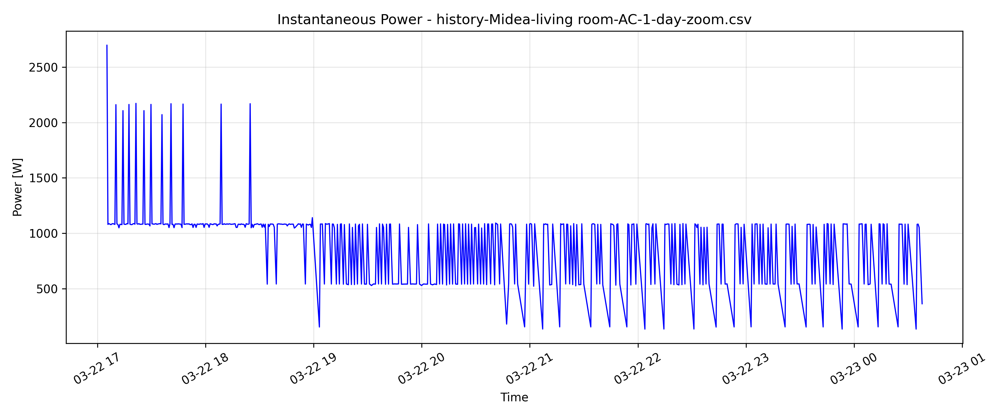
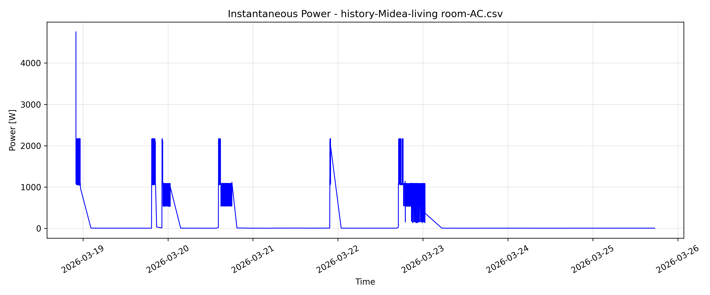

# Κατανάλωση Ηλεκτρικής Ενέργειας

## 1. Περιγραφή
Το σύνολο δεδομένων περιλαμβάνει μετρήσεις κατανάλωσης ενέργειας από δύο οικιακές συσκευές:

- Αφυγραντήρας (Dehumidifier)
- Κλιματιστικό (Midea Living Room AC)

Τα δεδομένα χρησιμοποιούνται για την ανάλυση της ενεργειακής συμπεριφοράς των συσκευών στον χρόνο.

## 2. Πηγές δεδομένων και συλλογή
Τα δεδομένα συλλέχθηκαν μέσω smart home συστήματος (π.χ. Home Assistant) και συγκεκριμένα από αισθητήρες κατανάλωσης ενέργειας (smart plugs / energy sensors).

Κάθε εγγραφή περιλαμβάνει:

- το αναγνωριστικό του αισθητήρα (`entity_id`)
- την τιμή μέτρησης (`state`)
- τη χρονική στιγμή καταγραφής (`last_changed`)

Τα δεδομένα αποθηκεύτηκαν σε μορφή CSV και η προεπεξεργασία και η ανάλυση πραγματοποιήθηκαν με scripts σε Python.

## 3. Δομή των δεδομένων

### Αφυγραντήρας

| Στήλη   | Τύπος     | Περιγραφή |
|--------------|----------|-------------|
| entity_id     | string   | ID αισθητήρα |
| state         | float    | κατανάλωση (W) |
| last_changed  | datetime | χρονική στιγμή μέτρησης |

### Δείγμα δεδομένων

| entity_id | state | last_changed |
|----------|------|-------------|
| sensor.dehumidifier_plug_current_consumption | 20.6 | 2026-03-22T22:19:37.698Z |
| sensor.dehumidifier_plug_current_consumption | 20.7 | 2026-03-22T22:19:57.707Z |
| sensor.dehumidifier_plug_current_consumption | 20.6 | 2026-03-22T22:20:02.702Z |
| sensor.dehumidifier_plug_current_consumption | 660.4 | 2026-03-22T22:20:12.699Z |
| sensor.dehumidifier_plug_current_consumption | 197.5 | 2026-03-22T22:20:17.697Z |
| sensor.dehumidifier_plug_current_consumption | 210.1 | 2026-03-22T22:20:22.704Z |
| sensor.dehumidifier_plug_current_consumption | 213.2 | 2026-03-22T22:20:27.700Z |
| sensor.dehumidifier_plug_current_consumption | 214.7 |2026-03-22T22:20:37.701Z |
| sensor.dehumidifier_plug_current_consumption | 215.5 | 2026-03-22T22:20:42.700Z |
| sensor.dehumidifier_plug_current_consumption | 216.9 | 2026-03-22T22:20:47.698Z |
| sensor.dehumidifier_plug_current_consumption | 217.3 | 2026-03-22T22:20:52.703Z |
| sensor.dehumidifier_plug_current_consumption | 217.2 | 2026-03-22T22:21:02.706Z |
| sensor.dehumidifier_plug_current_consumption | 217.4 | 2026-03-22T22:21:07.700Z |

---

### AC

| Στήλη   | Τύπος     | Περιγραφή |
|--------------|----------|-------------|
| entity_id     | string   | ID αισθητήρα |
| state         | float    | συνολική κατανάλωση κατά τη διάρκεια ζωής του κλιματιστικού |
| last_changed  | datetime | χρονική στιγμή μέτρησης |

### Δείγμα δεδομένων

| entity_id | state | last_changed |
|----------|------|-------------|
| sensor.153931628473058_total_energy_consumption | 1360.47 | 2026-03-22T22:00:00.000Z |
| sensor.153931628473058_total_energy_consumption | 1360.48 | 2026-03-22T22:03:52.306Z |
| sensor.153931628473058_total_energy_consumption | 1360.49 | 2026-03-22T22:04:25.511Z |
| sensor.153931628473058_total_energy_consumption | 1360.5 | 2026-03-22T22:04:58.690Z |
| sensor.153931628473058_total_energy_consumption | 1360.51 | 2026-03-22T22:05:32.093Z |
| sensor.153931628473058_total_energy_consumption | 1360.52 | 2026-03-22T22:06:05.323Z |
| sensor.153931628473058_total_energy_consumption | 1360.53 | 2026-03-22T22:07:12.299Z |
| sensor.153931628473058_total_energy_consumption | 1360.54 | 2026-03-22T22:07:46.626Z |
| sensor.153931628473058_total_energy_consumption | 1360.55 | 2026-03-22T22:08:19.807Z | 
| sensor.153931628473058_total_energy_consumption | 1360.56 | 2026-03-22T22:09:26.319Z |
| sensor.153931628473058_total_energy_consumption | 1360.57 | 2026-03-22T22:09:59.523Z |
| sensor.153931628473058_total_energy_consumption | 1360.58 | 2026-03-22T22:14:25.731Z |
| sensor.153931628473058_total_energy_consumption | 1360.59 | 2026-03-22T22:14:58.978Z |

## 4. Οπτικοποίηση

### Αφυγραντήρας

Καταγραφή για μία εβδομάδα. Η κατανάλωση είναι τις περισσότερες φορές είτε 0 - 20 W για standby κατάσταση είτε 200-220 W για κανονική λειτουργία. Οι τιμές 600-800 W δείχουν στιγμιαίες κορυφώσεις που συμβαίνουν κατά την εκκίνηση της συσκευής.

### AC

Καταγραφή για 8 ώρες (17:00 εώς 01:00). Στην αρχή φαίνεται σταθερή κατάσταση στα 1050–1100 W, με μερικές πολύ ψηλές αιχμές έως 2000–2700 W (τυπικά συμβαίνουν σε εκκίνηση/απότομη αύξηση φορτίου). Στις 19:00 η ισχύς κυμαίνεται κυρίως στα 550-1100 W με πολύ συχνές μεταβολές, που μοιάζει με ρύθμιση inverter (ο συμπιεστής ανεβοκατεβάζει στροφές για να κρατήσει θερμοκρασία). Οι επαναλαμβανόμενες καταστάσεις με 150–300 W δείχνουν φάσεις χαμηλής ισχύος/ρύθμισης.

Καταγραφή για μία εβδομάδα. Υπάρχουν μεγάλα διαστήματα με 0 W (το κλιματιστικό εκτός λειτουργίας) και στιγμές όπου η ισχύς κινείται κυρίως γύρω στα ~500–1100 W. Σε ορισμένες εκκινήσεις εμφανίζονται αιχμές 2000–2200 W, ενώ υπάρχει και μία πολύ υψηλή στιγμιαία κορύφωση περίπου 4500–4700 W.

Καταγραφή σε λίγα λεπτά με λεπτομερή χρονική ανάλυση. Η ισχύς εμφανίζει επαναλαμβανόμενους κύκλους όπου μένει στα 1050–1100 W και στη συνέχεια πέφτει προς 550–600 W, ενώ σε ορισμένα σημεία κάνει πιο έντονη πτώση μέχρι περίπου 150–200 W πριν επιστρέψει απότομα ξανά σε υψηλή ισχύ.

