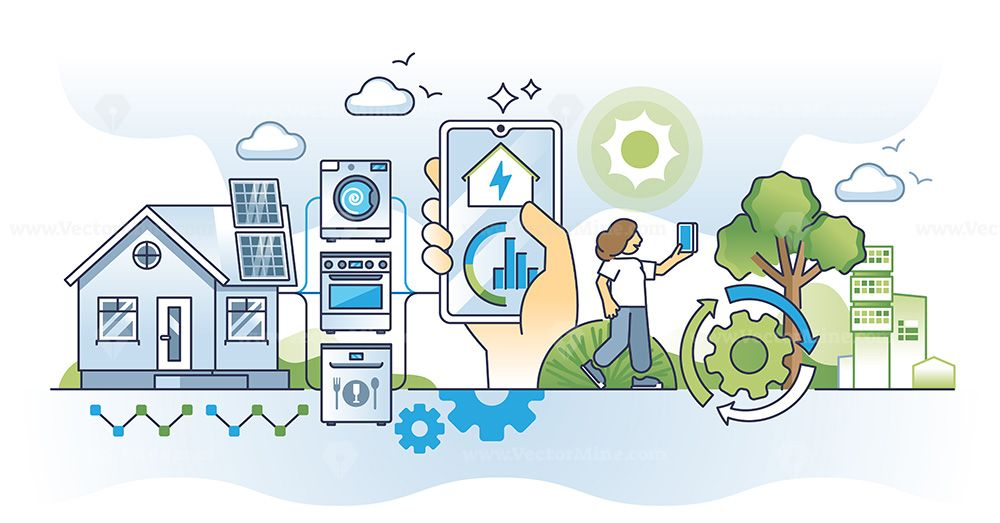

# Οικιακό προφίλ κατανάλωσης ηλεκτρικής ενέργειας

## Ομάδα :

- Γρίβας Αθανάσιος
- Χουλιάρας Βασίλειος
- Σωτηρίου Έλλη
- Γκούσκου Σοφία

  

## Το πρόβλημα

- Η δημιουργία ενός προφίλ κατανάλωσης ενέργειας επιτρέπει την εξαγωγή δεδομένων και τη διεξαγωγή αναλύσεων.
- Μέσω αυτής της διαδικασίας, οι ακατέργαστες μετρήσεις μετατρέπονται σε αξιοποιήσιμη γνώση.
- Οι πληροφορίες που προκύπτουν βοηθούν στη βελτιστοποίηση της χρήσης των οικιακών συσκευών.
- Ο χρήστης μπορεί να προγραμματίζει τη λειτουργία των συσκευών σε ώρες με χαμηλότερη ζήτηση και μικρότερο κόστος ενέργειας.
- Αυτό συμβάλλει στη μείωση των εξόδων του νοικοκυριού.
- Ενισχύεται η προστασία του περιβάλλοντος μέσω της μείωσης του ενεργειακού αποτυπώματος.
- Οι έξυπνοι αυτοματισμοί επιτρέπουν πιο αποδοτική και συνειδητή χρήση της ενέργειας.

## Δεδομένα

### Από συσκευές:

- Κατανάλωση από αισθητήρες καταγραφής κατανάλωσης συσκευών (σε Kwh/ημέρα)
- Στις συσκευες να βρούμε την ενδεικτική κατανάλωση τους (μέγιστη, ελάχιστη, μέση).

### Από το περιβάλλον 

- **Καιρός** (Πως επηρεάζει τη χρήση σύσκευων & πρόβλεψη) 
- **Αισθητήρες & Αυτοματισμοί** Πως επηρεάζει την κατανάλωση η χρήση αισθητήρων για αυτοματισμούς στην οικία.
- Αισθητήρες όπως:
- Κίνησης, Θερμοκρασίας, Υγρασίας κτλπ
- **Κατασκευή οικίας** (Μονώσεις στους τοίχους, παράθυρα, τύπος θέρμανσης κτλπ).

## Παρεχόμενος Εξοπλισμός

Ο εξοπλισμός που χρησιμοποιείται στο πλαίσιο της άσκησης περιλαμβάνει:

- **Έξυπνο κλιματιστικό με δυνατότητα Wi‑Fi (Midea Smart AC)**  
    Επιτρέπει απομακρυσμένο έλεγχο και παρακολούθηση λειτουργικών παραμέτρων μέσω δικτύου.

- **Έξυπνη πρίζα με δυνατότητα μέτρησης κατανάλωσης ενέργειας**  
    Χρησιμοποιείται για την καταγραφή της ενεργειακής χρήσης μιας LED λάμπας.

- **Σύστημα καταγραφής κατανάλωσης ισχύος υπολογιστικού συστήματος (Server)**  
    Η κατανάλωση ενέργειας της CPU και της GPU παρακολουθείται μέσω του λογισμικού HWiNFO, το οποίο παρέχει λεπτομερή τηλεμετρία σε πραγματικό χρόνο.

- **Πλατφόρμα αυτοματισμού Home Assistant**  
    Αξιοποιείται για τη συλλογή, αποθήκευση και απεικόνιση των μετρήσεων από τις συσκευές, καθώς και για την ενοποίηση των δεδομένων σε ενιαίο περιβάλλον. 

## Διαδικασίες περιβαλλοντικής πληροφορικής

- **Creation (Δημιουργία)** → Σύνδεση και παραμετροποίηση συσκευών/πηγών (πρίζα, server, κλιματιστικό).
- **Collection (Συλλογή)** → Καταγραφή μετρήσεων ισχύος (W) και/ή κατανάλωσης (kWh) με timestamps(χρονικές σφραγίδες).
- **Storage (Αποθήκευση)** → Αποθήκευση σε δομημένη μορφή (π.χ. πίνακες: *συσκευή, timestamp, W, kWh*).
- **Processing (Επεξεργασία)** → Καθαρισμός δεδομένων, υπολογισμοί (μέσοι όροι/αιχμές), μετασχηματισμοί ανά χρονικό διάστημα.
- **Modelling / Display / Interpretation (Μοντελοποίηση/Απεικόνιση/Ερμηνεία)** → Γραφήματα, συγκρίσεις, ποσοστά και εντοπισμός μοτίβων χρήσης των συσκευών.
- **Dissemination (Διάδοση)** → Τελική αναφορά με αποτελέσματα και συμπεράσματα της εργασίας.
